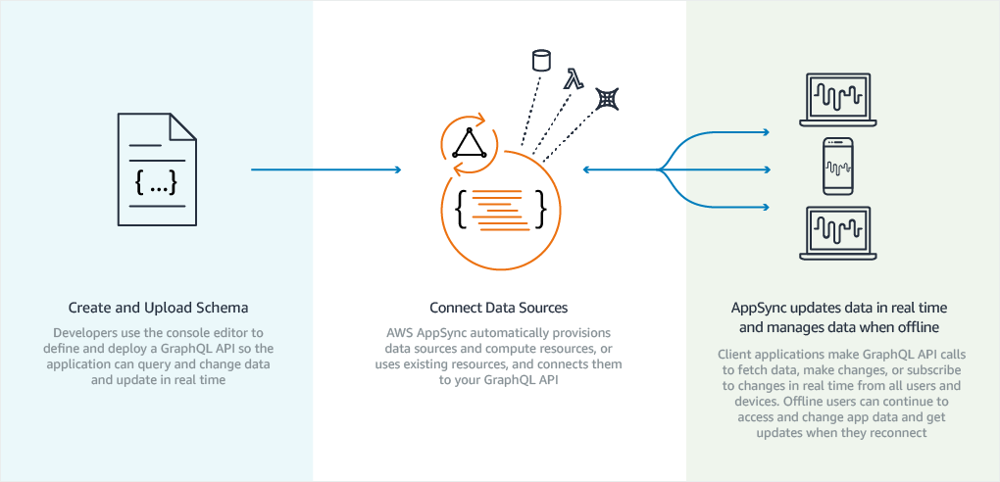

# BuildOps Challenge

## Usage

Install all dependencies

`npm install`

Run the application

`npm start`

## Setup

The project is built using the following technologies:

- Nodejs
- React
- Lambda
- DynamoDB
- AppSync
- Amplify

## AWS Services Explanation

### Lambda

Lambda allows running code without taking care of provisioning servers.

### Amplify

Amplify is a development platform for building mobile and web applications.

Using Amplify CLI it is possible to develop and integrate applications with AWS services during development
reducing the amount of time in configuring those services.

#### Basic Usage

Install AWS Amplify CLI

`npm i -g @aws-amplify/cli`

Configure with AWS account

`amplify configure`

Add Amplify to a project (in project root folder)

`amplify init`

Add API to project (REST or GraphQL)

`amplify add api`

Push changes to generate GraphQL API

`amplify push`

#### Usage with React

Install the following packages

`npm install aws-amplify aws-amplify-react`

### AppSync

AppSync is a development service which allows to integrate multiple data sources with AWS to be consumed by applications.
It includes NoSQL data stores, relational DBs, HTTP APIs, custom data sources with Lambda.
For mobile and web apps, it additionally provides local data access when devices gon offline, and data synchronization

### Serverless

Serverless is a development framework to create serverless instances for AWS Lambda service using common server templates.

Install the serverless framework

`npm install -g serverless`

Create a new project using a template

`sls create -t aws-nodejs`
